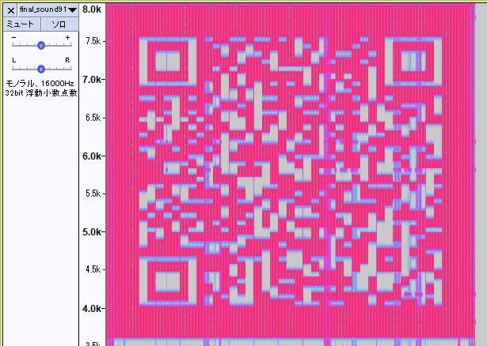

# morse-music (Steganography, Cryptography)

La challenge ci fornisce un file audio .wav. Andando a riprodurre l'audio riconosciamo che si tratta di codice morse.

Decodifichiamo il codice Morse nel file wav con https://morsecode.world/international/decoder/audio-decoder-adaptive.html e otteniamo il messaggio:

> DID YOU KNOW THAT THIS IS NOT ABOUT THE MORSE CODE? IT IS ABOUT THE SPECTROGRAM ONLY THAT THE PASSWORD IS UHR3V8203RJD

Apriamo il file in Audacity o in SonicVisualizer e controlliamo lo spettrogramma. Dopo aver regolato la frequenza di campionamento, riusciamo a  vedere il codice QR.



Scansionando il codice QR otteniamo i seguenti dati:

> Njw0SGcLVwJVZ358MC0xBmUMClMKanlzZSpnAjVeBgVRMX0lYyliA2RaB1UDY3ghMHw0UGUPAQAHNysnNClmAjMPA1VO

Facciamo lo XOR dei dati decodificati base64 con la password ottenuta dalla decodifica del codice Morse.

```python
#!/usr/bin/env python3
from base64 import *

password = b'UHR3V8203RJD'

ct = 'Njw0SGcLVwJVZ358MC0xBmUMClMKanlzZSpnAjVeBgVRMX0lYyliA2RaB1UDY3ghMHw0UGUPAQAHNysnNClmAjMPA1VO'
ct = b64decode(ct)

flag = ''
for i in range(len(ct)):
    flag += chr(ct[i] ^ password[i % len(password)])
print(flag)
```


Otteniamo la flag:

> ctf{13e2f548eec5348c98370b51cf45bc7a6a002b5e012ee4fc37304eacaa41e71e}