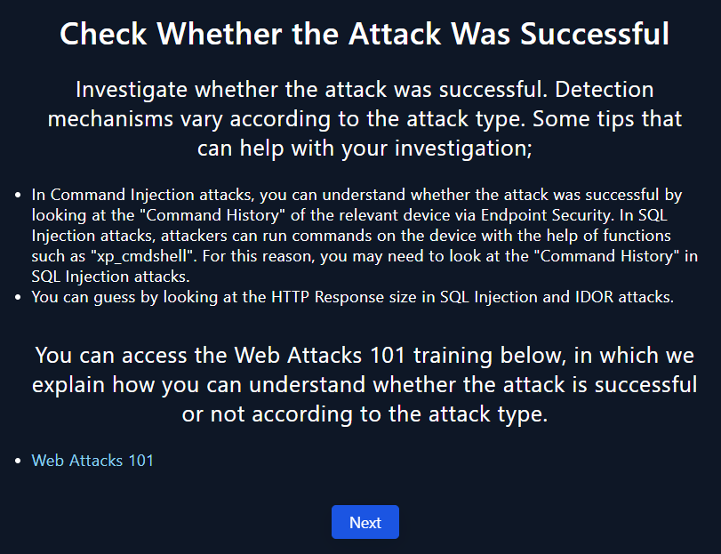
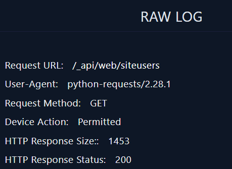

# SOC227 — Microsoft SharePoint Server Elevation of Privilege — Exploiting CVE-2023-29357

## Introduction
The vulnerability identified as `CVE-2023-29357` represents a critical elevation of privilege flaw in Microsoft SharePoint Server. When chained with other vulnerabilities, it can enable remote code execution (RCE) under certain conditions, leading to full system compromise. This vulnerability carries a CVSS score of 9.8 (Critical), emphasizing its potential severity if left unpatched.

## Walkthrough

The first step is to establish a structured incident response approach by creating a comprehensive playbook to address this alert.

The playbook’s initial phases offer investigative guidelines to ensure a methodical and thorough analysis of the incident.

## Preliminary Artifacts

As referenced in the alert introduction, the following preliminary artifacts must be gathered to facilitate the investigation:
- **Hostname**: `MS-SharePointServer`
- **Source IP Address**: `39.91.166.222`
- **Destination IP Address**: `172.16.17.233`
- **Requested URL**: `/_api/web/siteusers`

## Walkthrough

Given the involvement of an external IP address (`39.91.166.222`), I initiated an investigation by querying IP reputation databases such as **IPQS** and **VirusTotal**. The results confirmed that the IP address is flagged as malicious and is associated with **China Unicom**.

Subsequently, I reviewed relevant logs via the **Log Management** dashboard. The following logs were collected:

Armed with this data, we continue to execute the incident response playbook.

Given the malicious categorization of the source IP (39.91.166.222) by VirusTotal and IPQS, and corroborating log entries, we can conclude that the traffic is **malicious** in nature.

We categorize the attack under the `Other` classification because its nature does not align with the pre-defined attack vectors.

Further, I expanded the investigation by querying **Email Security** systems for artifacts (such as IP addresses or server names) that may be linked to the alert. No associated email-based threats were discovered, hence this part of the investigation was `not planned`.

The attack’s source address (39.91.166.222) was identified as external to the company network, while the destination address (172.16.17.233) pertains to the internal **MS-SharePointServer**. This traffic flow represents a potential compromise scenario with a directionality of `Internet → Company Network`.

The attack was confirmed to be **successful** based on evidence of unauthorized access to `/currentuser` and `/siteusers` URLs on the SharePoint server.

### Containment Actions

Given the successful nature of the attack, immediate containment is required to prevent further compromise. In **Endpoint Security**, I searched for the destination IP `172.16.17.233` and applied a **containment policy** to the affected endpoint, effectively isolating the attacker’s access.

Once containment was confirmed, all relevant artifacts were recorded in the playbook to document the investigation process.

### Escalation and Closure

Due to the successful breach and the potential scope of compromise, escalation to **Tier 2** is warranted for further, in-depth analysis by more experienced analysts.

Finally, the alert is flagged as a **true positive**, and the case is closed following standard operating procedures.

